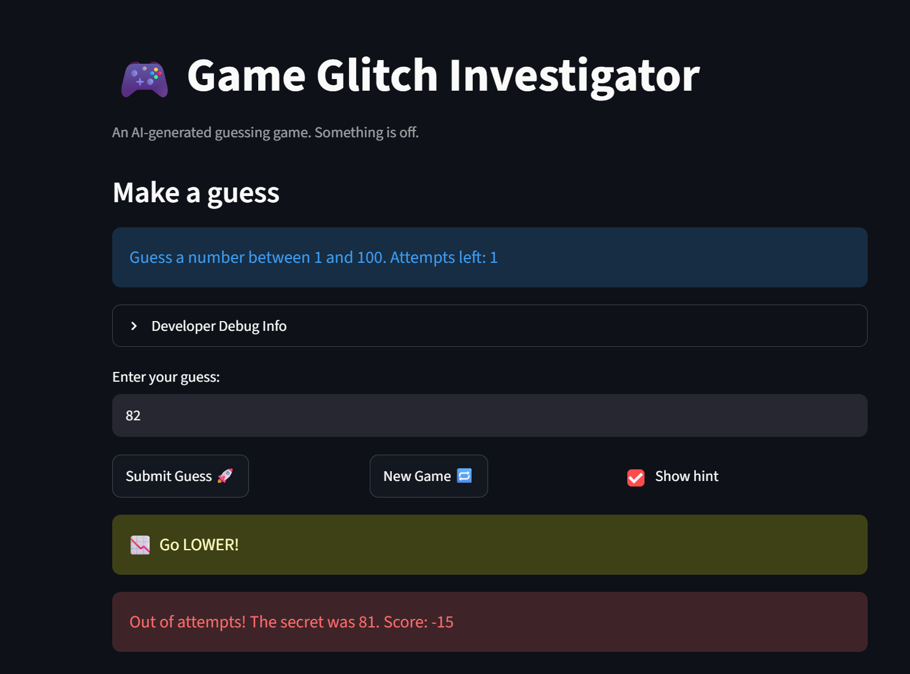

# 🎮 Game Glitch Investigator: The Impossible Guesser

## 🚨 The Situation

You asked an AI to build a simple "Number Guessing Game" using Streamlit.
It wrote the code, ran away, and now the game is unplayable. 

- You can't win.
- The hints lie to you.
- The secret number seems to have commitment issues.

## 🛠️ Setup

1. Install dependencies: `pip install -r requirements.txt`
2. Run the broken app: `python -m streamlit run app.py`

## 🕵️‍♂️ Your Mission

1. **Play the game.** Open the "Developer Debug Info" tab in the app to see the secret number. Try to win.
2. **Find the State Bug.** Why does the secret number change every time you click "Submit"? Ask ChatGPT: *"How do I keep a variable from resetting in Streamlit when I click a button?"*
3. **Fix the Logic.** The hints ("Higher/Lower") are wrong. Fix them.
4. **Refactor & Test.** - Move the logic into `logic_utils.py`.
   - Run `pytest` in your terminal.
   - Keep fixing until all tests pass!

## 📝 Document Your Experience

- [ ] Describe the game's purpose.
The game was a basic guess the number type game. The user inputs numbers with a limited number of guesses to try to guess the secret number. The app tells the user if their number was too high or too low. If their number matches the secret, the user wins.
- [ ] Detail which bugs you found.
The logic behind telling the user if their number was too high or low was broken. And starting a new game caused the submit guess button to fail.
- [ ] Explain what fixes you applied.
I fixed the logic errors in the guess checking process and I fixed the session state error that prevented new games from functioning correctly.

## 📸 Demo Walkthrough

Playing on Normal difficulty (range 1-100, 8 attempts). For this run the secret is 63:

1. User enters a guess of 40 -> game returns "Too Low" with the hint "Go HIGHER!".
2. User enters a guess of 80 -> game returns "Too High" with the hint "Go LOWER!" (consistent direction; no more flipped hints).
3. User enters a guess of 63 -> game returns "Correct!", balloons fire, and the final score is displayed.
4. The score updates correctly after each guess - every guess compares the entered int against the stored int secret, so hints and scoring stay consistent across attempts.
5. The game ends on the correct guess (status -> won). Clicking New Game resets attempts, secret, history, and status back to playing, so the Submit Guess button works again for the next round.

Screenshot (optional): 

## 🧪 Test Results

python -m pytest
================================================================================= test session starts ==================================================================================
platform win32 -- Python 3.14.6, pytest-9.1.1, pluggy-1.6.0
rootdir: C:\Users\asher\repos\ai110-module1show-gameglitchinvestigator-starter
plugins: anyio-4.14.0
collected 6 items                                                                                                                                                                       

tests\test_game_logic.py ......                                                                                                                                                   [100%]

================================================================================== 6 passed in 0.03s ===================================================================================

## 🚀 Stretch Features

- [ ] [If you choose to complete Challenge 4, describe the Enhanced UI changes here — a screenshot is optional]
